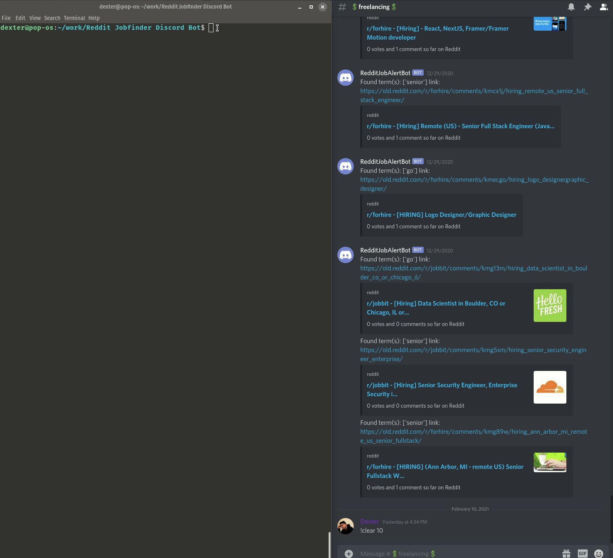

# Reddit Job Finder Discord Bot
<p align="center">
  
</p>
<p align="center">
	<a href="https://gitmoji.dev">
		
	</a>
</p>

A Discord bot that is using AsyncPRAW, a Reddit API to find jobs on subreddits and post them to your Discord channel.
I created this bot for programmers so feel free to edit keywords list and subreddit list for your requirements.


## Setup
You'll need to create:
 - Reddit Applications: https://www.reddit.com/prefs/apps
 - Discord Bot: https://discord.com/developers/applications
 
Create a local.env and update with your details:
```bash
make envs
```

## Usage with Pipenv

```bash
make install && make shell
make load
make start
```

## Usage with Requirements.txt
```bash
make requirements
make load
make start
```

## Contributing
Pull requests are welcome. For major changes, please open an issue first to discuss what you would like to change.

Please make sure to test before pull request.

## License
[MIT](https://choosealicense.com/licenses/mit/)
